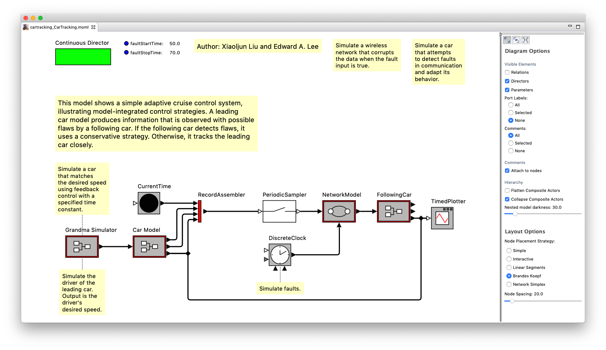
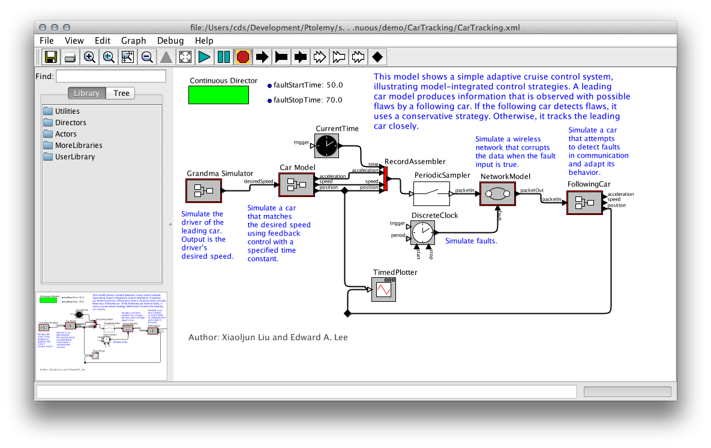
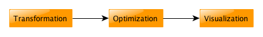

# KIELER Ptolemy Browser

The KIELER Ptolemy Browser generates transient views of [Ptolemy II](https://ptolemy.berkeley.edu/ptolemyII/index.htm) models that are easy to browse through. The Ptolemy Browser uses [KLighD technology](https://rtsys.informatik.uni-kiel.de/confluence/x/swEF) for visualization and [ELK](https://www.eclipse.org/elk/) for automatic layout.

Ptolemy II is an open source program developed at UC Berkeley for experimenting with actor-oriented modelling. Actors are graphical representations of components with a certain functionality that generate outputs as a function of the inputs they receive. To use the output of one actor as the input of another, actors are connected by links.

The Ptolemy Browser shows models like this:

In the original Ptolemy II editor, the same model might look like this:

Note how the Ptolemy Browser allows to look inside actors in the same window. In Ptolemy, the innards of an actor need to be opened inside a separate window.

## Download

* The *standalone KIELER Ptolemy Browser* can be downloaded [over here](https://rtsys.informatik.uni-kiel.de/%7Ekieler/files/nightly/ptbrowser/).
* The *necessary Eclipse Plug-ins* can be installed from [this update site](https://rtsys.informatik.uni-kiel.de/%7Ekieler/updatesite/nightly-openkieler/ptbrowser/).

## Background

In some respect, Ptolemy models are a typical example of graphical modelling languages:

* Actors are represented as boxes, with edges connecting the actors to each other. The edges are routed orthogonally: each edge segment is aligned either horizontally or vertically.
* Actors can have more than one input, and more than one output. To be able to distinguish the data coming in and going out, inputs and outputs are routed to dedicated connection points, called ports. Thus, links never connect two actors directly, but rather connect them through their ports.
* Actors can contain further models that define their functionality (we call such actors hierarchical actors). To be able to see the model inside an actor, Ptolemy provides the possibility to look inside the actor. This effectively opens a new Ptolemy window displaying the actor's implementation.

However, Ptolemy models have some features that are not that common:

* Ports are not restricted to be either input ports or output ports: they can be both. As a consequence, links are undirected and can transport data in both directions.
* Models have a director that defines the model of computation used to execute the model. In fact, if an actor in turn has another model inside it, that model, too, has a director. One of the research goals of the Ptolemy project is to find out how different models of computation can be composed.
* All edges are part of relations. A relation is a set of edges that are treated as a hyperedge: an edge that connects not two, but arbitrarily many ports.

The key to the Ptolemy Browser is that visualizations are created on-demand as one browses through the Ptolemy Models. The project is based on research effort at Kiel University which has found its way into the following papers, among others:

* Christian Schneider and Miro Spönemann and Reinhard von Hanxleden. [Just Model! – Putting Automatic Synthesis of Node-Link-Diagrams into Practice](https://rtsys.informatik.uni-kiel.de/~biblio/downloads/papers/vlhcc13.pdf). In Proceedings of the IEEE Symposium on Visual Languages and Human-Centric Computing (VL/HCC ’13), page 75–82, San Jose, CA, USA, September 2013.
* Christoph Daniel Schulze and Miro Spönemann and Reinhard von Hanxleden. [Drawing Layered Graphs with Port Constraints](https://rtsys.informatik.uni-kiel.de/~biblio/downloads/papers/jvlc13.pdf). Journal of Visual Languages and Computing, Special Issue on Diagram Aesthetics and Layout, 25(2):89–106, 2014.

## KLighD Visualization

With our KLighD visualization, we aim to develop a Ptolemy model browser that is particularly good at helping users read through Ptolemy models. It is able to directly open Ptolemy files and display them in a way very similar to what Ptolemy users are used to seeing. The biggest change with respect to how Ptolemy shows models is that our model viewer allows to expand hierarchical actors in-place, without having to open a new window. This helps users understand the context a hierarchical actor is placed in: by understanding where inputs come from and where outputs go to, users also better understand what the hierarchical actor is doing and what it is used for.

Open and browse a Ptolemy model:

* Start the KIELER Ptolemy Browser.
* Open the [CarTracking](https://raw.githubusercontent.com/icyphy/ptII/master/ptolemy/domains/continuous/demo/CarTracking/CarTracking.xml) Ptolemy model, which you can download from the Ptolemy's [GitHub repository](https://github.com/icyphy/ptII).
* Open and close some of the hierarchical actors by double-clicking them.

We have also added further features that may be helpful when browsing models:

* Annotations can be shown or hidden.
* A heuristic tries to find out which actor an annotation is providing the documentation for. This is based on the distance between actors and annotations, with a threshold value after which an annotation is considered to stand alone. This attachment between annotations and actors is displayed by a dashed line, and the layout algorithm makes sure the two are placed near each other.
* Relations in Ptolemy are visualized by small diamond-shaped nodes. Often, these are only used to influence the edge routing. Since we use a layout algorithm to route edges properly, these relation vertices are not necessary. We replace all of them by hyperedges and route the edges properly. An option lets you disable this behaviour: then, only relation vertices with exactly one incoming and one outgoing edge are removed and replaced by a simple edge.
* Expanded hierarchical nodes have a background color that gets darker with each level of hierarchy. How dark this color is can be changed to adjust for projectors and printers that are not as good at showing sublte colors.
* The properties of actors and ports are shown as tool tips. This does not include advanced properties, which are those properties that start with an underscore.

## How This Stuff Works

All of this functionality is implemented in one main plug-in and two support plug-ins:

* `de.cau.cs.kieler.ptbrowser.klighd` contains the actual transformation that turns Ptolemy files into something we can display with KLighD.
* `org.ptolemy` contains a reduced Ptolemy version that we use to render actors. Not all actors are available in this distribution.
* `org.ptolemy.moml` contains an EMF model that we use to load Ptolemy files.

For the rest of this page, we will describe the basics of how the transformation works and the challenges it presented.

### Architecture of the Transformation

The transformation is mostly written in Xtend. Its entry point is the PtolemyDiagramSynthesis class, which is registered with KLighD for the visualization of MOML models. It triggers the three different stages of the transformation:

1. The basic transformation. This is what turns a given MOML model into a KGraph model.
1. An optimization step. A direct transformation of the MOML model doesn't give the best results, which makes this postprocessing step necessary.
1. The visualization. This step adds the KRendering information necessary for KLighD to actually display the model.

It would certainly be possible – and perhaps even faster – to combine these stages into one. Doing this, however, would result in code that only John Carmack would understand. And even he would curse reading it. Who wouldn't.

### Generating the Basic KGraph Model

The basic KGraph model is generated by turning all entities and relations into nodes, all ports into... well, ports, and all links into edges. The logic for all of this is implemented in the `Ptolemy2KGraphTransformation` class and is actually a bit more complex than we just made it sound.

While the model lists a number of entities that are instances of a given actor class, it usually doesn't contain any information about the ports this kind of actor has. To work around this, the transformation tries to use our Ptolemy library to instantiate the actor and query it for its ports. If this succeeds, we add the ports to the actor's representation in the KGraph model and annotate them with information about whether they are input or output ports. If it doesn't – which happens when our Ptolemy library doesn't contain the actor – we add ports to the actor as they are referenced by the links incident to them. In this case, we don't know whether a port is an input port or an output port. Deriving this information is actually (the hardest) part of the next stage.

Just about everything in Ptolemy can have properties. Even properties can have further properties. These properties carry important semantic information that someone browsing the model would want to know, so we copy them into the KGraph for later visualization.

### Optimizing the KGraph Model

Being the most complex stage, the optimization is necessary for the model to be properly displayed. The code can be found in the `Ptolemy2KGraphOptimization` class and solves the following problems:

* Infer edge directions. Links in Ptolemy are undirected, while edges in the KGraph metamodel are directed. Our layout algorithms, too, assume directed input graphs and emphasize the flow of data. This requires us to infer the correct direction of edges, which is a hard thing to do and doesn't always give correct results. We use a heuristic that first fixes the direction of edges connected to ports that are known to be either input ports or output ports. Going from there, we try to infer the direction of further edges. For example, if a relation has only two incident edges of which one has a known direction, the direction of the second edge is easy to infer. If this second edge goes into a port of unknown type, we can safely assume the port to be an input port and then infer the direction of other edges incident to the port. This system starts to give wrong results once we have many ports of unknown type.
* Remove relation vertices. In Ptolemy, all links connect either two relations, or one port and one relation. If a relation only connects two ports, we can replace it by a simple edge, which improves layout and clarity. Since our main layout algorithm, ELK Layered, supports routing hyperedges (edges that connect more than two ports), we can even go a step further: for each relation, we collect the input ports and the output ports it connects. We then connect each input port to each output port directly, thereby removing the relation.
* Remove ports from states of modal models. States don't need dedicated connection points since transitions between states don't model the flow of data, but the flow of control from one state to the next.
* Convert certain properties to dedicated nodes. Each Ptolemy model has a director that specifies the model of computation to use when executing the model. In Ptolemy, the director is drawn as a green rectangle, very much like a node. In the model, however, the director is a property of the model entity and thus wasn't transformed into a node in the KGraph during the first stage. Also, each model can have parameters also saved as properties. We collect the parameters and turn them into a node that can display them later.
* Extract annotations from the model. In Ptolemy, models can be annotated (in programming languages, annotations would be comments; if you are a programmer and have no idea what comments are, you haven't found the right field of work for you yet). The text of annotations is sometimes a simple property of the annotation, in which case visualizing it is straightforward. Often enough, however, the text is specified as an SVG image. This is a problem because the SVG metamodel is not part of the MOML metamodel, which in turn causes the EMF parser that loads the model to panic. We thus wrote code that finds such SVG images and tries to extract the annotation text from them. This usually works.

### Adding Rendering Information to the KGraph Model

If we fed the KGraph coming out of stage 2 into KLighD, it wouldn't look at all like a Ptolemy model – if anything was displayed at all. For KLighD to know how to render our model, we need to attach KRendering information to the nodes, ports, and edges. The final stage, implemented in the `Ptolemy2GraphVisualization` class, adds these information. The implementation is actually very simple: for each entity, a big switch statement decides what kind of rendering the entity requires and delegates to a corresponding method. The method then adds layout information to the entity and delegates the creation of the actual KRenderings to another method defined in the `KRenderingFigureProvider` class. Then, the entity's ports and outgoing edges are treated similarly. Finally, labels and tool tips are handled.

Only one detail deserves some more explanation: how we get our hands at how entities are rendered in Ptolemy. This is done through a mechanism similar to what we already used in the first stage: we simply instantiate the entities using our Ptolemy library, ask Ptolemy to render them, and convert the rendering information into something KLighD supports. This can either be SVG code (if the rendering was originally specified as an SVG image) or a bitmap image. If an actor cannot be instantiated, we have no rendering information and display the actor as a simple rectangle with a black border and white background.